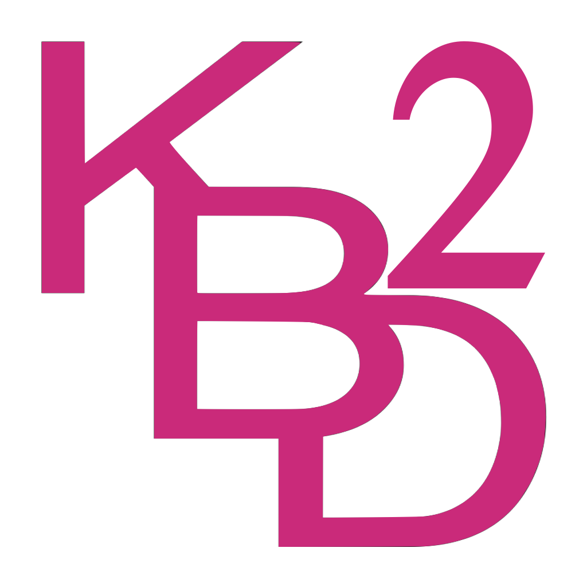

# KBD2

A floating alphanumeric keyboard for macOS. It sits above every window, on
every Space, and types into whatever text field currently has focus — in any
application.

The full-keyboard sibling of [KBD](https://github.com/spurious-cox/kbd), which does the same job for a
numeric keypad.



## What it does

- **Never steals focus.** The panel is a non-activating `NSPanel` with no Dock
  icon and no menu bar, so clicking a key leaves the cursor exactly where it
  was, in the field you are typing into.
- **Floats over everything**, including full-screen apps, and follows you
  across Spaces.
- **SHIFT LOCKS.** It is a toggle, not a held key: tap it on and every letter
  arrives uppercase and every dual-legend key sends its upper symbol; tap it
  off and both revert. The engaged key fills with a lighter face, and each key
  draws its live legend bright with the other dimmed, so the state is readable
  key by key.
- **Cursor keys and forward delete** — `←` `→` step the insertion point and
  `⌦` deletes ahead of it, all through the keyboard itself.
- **Drag it anywhere** on the coloured field, header included.
- **Resize** by the corner grip, by option-dragging, or from the size menu.
  The whole keyboard scales as one.
- **Transparent by default.** Nothing is painted behind the keys, so the gaps
  show whatever is underneath. Dragging still works in those gaps — hit
  testing goes by frame, not by alpha. **Show Backing** on the menu restores a
  solid field, and the choice is remembered.
- **Nine key colours**, from the `•••` at either end of the header or from a
  right-click anywhere. The colour lands on the key faces, the legends flip to
  whatever contrasts, and the field takes a darkened version of the same hue.
- **Position, size and colour are remembered** across launches.

## Layout

Five rows on a fourteen-column grid. Every key is one column wide except
SHIFT, RETURN and DISMISS (two each) and the space bar, which takes what is
left of row five beside the globe.

```
~  1  2  3  4  5  6  7  8  9  0  -  =  ⌫
q  w  e  r  t  y  u  i  o  p  [  ]  \  ⌦
⇪⇪    a  s  d  f  g  h  j  k  l  ,  ;  '
⇥  ←  →  z  x  c  v  b  n  m  .  /  ↩↩
🌐    ␣ ␣ ␣ ␣ ␣ ␣ ␣ ␣ ␣ ␣ ␣    DISMISS
```

**Rows one to four are the same layout as the iOS version of KBD2, key for
key and column for column**, so nothing moves between a Mac, an iPad and an iPhone. That
match is why there are no `^` `⌥` `⌘` keys: an iOS keyboard extension reaches
the text field only through `UITextDocumentProxy`, which cannot send
modifiers, so those three slots carry the cursor keys instead. **KBD2 cannot
send ⌘C or any other shortcut** — use the hardware keyboard for those.

Row five is the one deliberate difference between the two. iOS has no globe of
its own to place and an extension cannot quit itself, so there it carries the
space bar alone; on the Mac it holds the globe, the space bar and **DISMISS**,
which is two columns wide like the RETURN above it and quits the app.

The **globe** lists the other keyboard layouts macOS has enabled and switches
to the one you pick. With only one enabled — the usual Mac — there is nothing
to switch to, so it says **"no keyboards found"** in the header for a few
seconds and changes nothing. The message goes in the header rather than an
alert: a dialog would take focus off the field being typed into.

## Accessibility permission

macOS only lets an app post keystrokes to other applications once you allow
it, so KBD2 asks on first launch and offers to open the right settings pane.
It keeps watching, and the warning in its header clears the moment you grant
it. See [PRIVACY.md](PRIVACY.md) for what that permission does and does not
allow.

KBD2 has its own bundle id (`com.timmccoy.kbd2`), so it holds a **separate**
grant from KBD — allowing one does not allow the other.

## Building

Uses KBD's virtual environment rather than keeping a second copy of PyObjC and
py2app in step:

```
../KBD/venv/bin/python make_icon.py     # only when the artwork changes
./build.sh --install                    # build, sign, install to /Applications
./release.sh                            # notarize + staple, and build a DMG
```

`APP_VERSION` in `kbd2.py` is the single source of truth for the version;
`setup.py` reads it, and the app draws it in its own header.

The icon and the header mark are both built from `icon/KBD2Icon_source.png`,
Tim's own artwork, which already contains the 2 — nothing is composed beside
it. Opacity is recovered from the darkest channel rather than luminance:
luminance is right for black ink and wrong for coloured ink, and the magenta
came out only ~62% opaque the first time.

### Checking the layout without launching it

```
KBD2_SKIP_AX_PROMPT=1 ../KBD/venv/bin/python render_test.py out.png [colour] [scale] [shift]
```

Renders the panel straight to a PNG and exits, leaving no app instance
running and needing no screen-recording permission. It also prints each row's
key count and total span, so a misaligned key shows up as a number rather
than only as a picture — every row should span exactly the same width.

## Licence

MIT — see [LICENSE](LICENSE).
